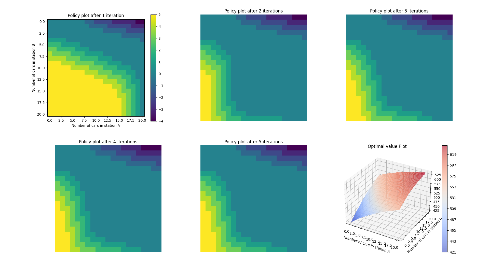

## Problème de Location de voitures de Jack

### Description du problème

Jack gère deux emplacements pour une société de location de voitures
nationales. Chaque jour, un certain nombre de clients arrivent à chaque endroit
pour louer des voitures. Si Jack dispose d'une voiture disponible, il la loue
et est crédité de 10 $ par la société nationale. S'il est hors de voitures à
cet endroit, l'entreprise est perdue. Les voitures deviennent disponibles pour
la location de la journée après leur retour. Pour vous aider à garantir que les
voitures sont disponibles là où elles sont nécessaires, Jack peut les déplacer
entre les deux emplacements du jour au lendemain, à un coût de 2 $ par voiture
déplacée. Nous supposons que le nombre de voitures demandées et renvoyées à
chaque emplacement sont des variables aléatoires de **Poisson**. Supposons
que λ soit 3 et 4 pour les demandes de location aux premier et deuxième
emplacements et 3 et 2 pour les retours. Pour simplifier légèrement le
problème, nous supposons qu'il ne peut y avoir plus de 20 voitures à chaque
emplacement (toutes les voitures supplémentaires sont renvoyées à la société
nationale et disparaissent ainsi du problème) et un maximum de cinq voitures
peuvent être déplacées d'un endroit. à l'autre en une nuit. Nous prenons le
taux d'escompte pour être γ = 0,9 et formuler cela comme un MDP fini continue,
où les étapes temporelles sont des jours, l'état est le nombre de voitures à
chaque emplacement à la fin de la journée et les actions sont les numéros nets
des voitures déplacées entre les deux endroits du jour au lendemain.

**Référence: *livre "Reinforcement learning: An Introduction", Chapitre 4, page: 81.***


### Implémentation

1. Définition des paramètres globales

``` python
rent_cost = 10 # income from renting single car
move_cost = 2 # cost to move single car
discount = 0.9 # discount
max_garage_cars = 20 # max number of cars in a location/station
max_moved_car = 5 # max number of allowed cars to move from one location to another over night
stable = False
policies = []
accuracy = 1e-6

lambda_return = [3, 2] # λ values for renting in location A and B respectively
lambda_rent = [3, 4] # λ values for returns in location A and B respectively
```

2. Définition des matrices
     1. la valeur par état
     2. la politique par état
     3. la valeur par état
     4. politique par état

``` python
A = np.zeros((21,21), dtype=np.int32) # action per state == policy
V = np.zeros((21,21), dtype=np.float32) # value per state
R = np.zeros((2 ,21), dtype=np.float32) # value per state per location
T = np.zeros((2 ,21,21), dtype=np.float32) # transition probability matrix per location from state Si to Sj
```

3. Calcul des matrices R et V

``` python
def trans_prob(self, s, garage):
  """
  Update the transition probalility matrix starting from stat 's' for the location 'garage'

  this function loops first over all possible renting
  requests then loops over all possible returns, then
  it updated the matrices R and T
  """
  for r in range(max_garage_cars + 1):
    p_rent = poisson_prob(lambda_rent[garage], r)
    if p_rent < accuracy:
      return
    rent = min(s, r)
    R[garage, s] += p_rent * rent_cost * rent
    for ret in range(max_garage_cars + 1):
      p_ret = poisson_prob(lambda_return[garage], ret)
      if p_ret < accuracy:
        continue
      s_next = min(s - rent + ret, max_garage_cars)
      T[garage, s, s_next] += p_rent * p_ret

def init_trans_prob(self):
  """
  Calculate the transition probability maxtrix
  """
  for i in range(max_garage_cars+1):
    self.trans_prob(i, 0)
    self.trans_prob(i, 1)

```
3. Évaluer une politique

``` python
def policy_evalue(self):
  """
  Evaluate the policy A
  """
  delta = 0
  for i in range(max_garage_cars+1):
    for j in range(max_garage_cars+1):
      v = V[i, j]
      a = A[i, j]
      V[i, j] = self.value_calculate(i, j, a)
      delta = max(delta, np.abs(v-V[i, j]))
  return delta

def value_calculate(self, i, j, a):
  """
  Compute the value of a action given a state
  """
  if a > i:
    a = i
  elif a < 0 and -a > j:
    a = -j
  ii = int(i - a)
  jj = int(j + a)
  ii = min(ii, max_garage_cars)
  jj = min(jj, max_garage_cars)
  temp_v = -np.abs(a) * move_cost
  for m in range(max_garage_cars + 1):
    for n in range(max_garage_cars + 1):
      temp_v += T[0,ii,m]*T[1,jj,n]*(R[0,ii] + R[1,jj] + discount*V[m,n])
  return temp_v
```


4. Améliorer la politique

```
def action_greedy(self, i, j):
  """
  Compute the greedy action given a state
  """
  best_action = 0
  best_value = 0
  for a in range(-max_moved_car, max_moved_car+1):
    if a > i:
      continue
    elif a < 0 and -a > j:
      continue
    val = self.value_calculate(i, j, a)
    if val > (best_value + 0.1):
      best_value = val
      best_action = a
  return best_action

def policy_improve(self):
  """
  Sweep over the state space and compute the new best policy
  """
  stable_flag = True
  for i in range(max_garage_cars + 1):
    for j in range(max_garage_cars + 1):
      act_best = self.action_greedy(i, j)
      if act_best != A[i, j]:
        A[i, j] = act_best
        stable_flag = False
  return stable_flag
```
### Résultats


